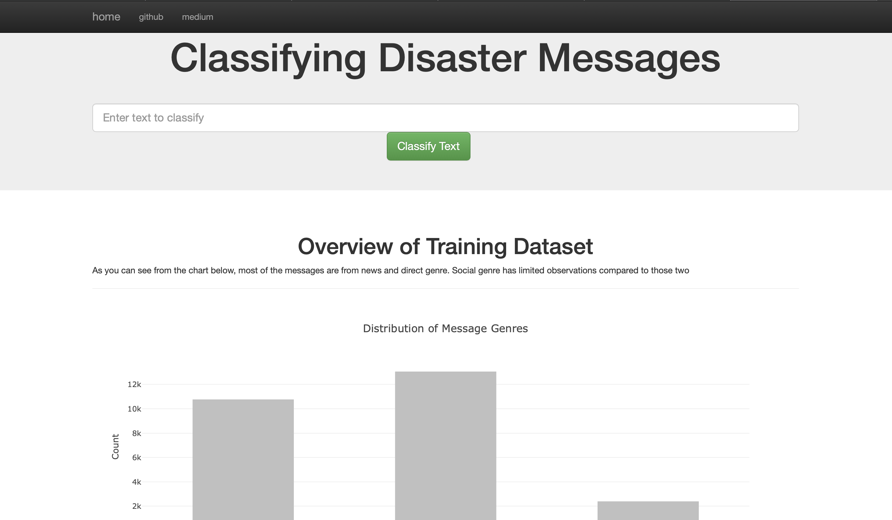

# Disaster Response Pipeline Project
In this repository I share the code underlying the text-classifier web app that I published here:
> https://disaster-nlp-app.herokuapp.com

As you can see from the web-app, the aim of this project is to build a text classsifier to detect disaster messages.

## Organization of the Repository
**data** folder contains **ETL** processes.
**models** folder contains the **ML Pipelines**
**app** folder contains web-app related code. 

**requirements.txt** contains dependencies
**nltk.txt** contains nltk dependencies for **heroku** environment.

## Instructions:
1. Run the following commands in the project's root directory to set up your database and model.

    - To run ETL pipeline that cleans data and stores in database, first cd into data directory.
   
      >`python process_data.py '\
      'disaster_messages.csv disaster_categories.csv '\
      'DisasterResponse PostEtl`
   
    - To run ML pipeline that trains classifier and saves, first cd into models directory.
      > `python train_classifier.py ../data/DisasterResponse.db PostETL ClassifierName.pkl`

2. Run the following command in the app's directory to run your web app.

   >`python run.py`

3. Go to http://0.0.0.0:3001/

## Remarks and References

### Underfitting due to Poor Training 
My main motivation behind this project is to demonstrate my **pipelining skills** (from ETL to deployment) rather than
building a strong predictive model. For this reason, the **Catboost classifier** was trained with really low iterations.
For the same reason, I kept the parameter grid for the **GridSearchCV** really narrow. With more iterations and better 
grid search optimization, the classifier performance can be increased. However, this requires investing more time on 
training. Nevertheless, if more time and computational power are available, then, I would pick any model listed on
hugginface.co over catboost classifier. 

### Underfitting due to Class Imbalance
The categories are not equally represented in the dataset. There are even some categories with no observations. This is 
called class imbalance. In this project, I took no action to counter class imbalance problem. In the mockup phase, I 
attempted to use SMOTE from imbalanced learn library. But both sklearn pipeline and encoding of the target (multilabel) 
was creating incompatibilities and for this reason I decided not to continue with this line.

### Reference
The plotly script was not visible on my app. I tried my own solutions but couldn't figure out the reason by myself. I 
learned the solution to this problem at
>
> https://github.com/quantumphysicist/Disaster-Response-Pipelines/blob/main/app/templates/master.html

I used the the repo above as reference for my visualisations aesthetics as well. I would like to thank the author. 

The second problem I faced was deploying the app to **Heroku**. I learned about nltk.txt file from the Heroku error 
messages, however, even after fixing the nltk issues, the was not running. I learned about the proper procfile & 
def main() configurations from this repository.
>
> https://github.com/madkehl/DisasterResponse/tree/main/web_app
